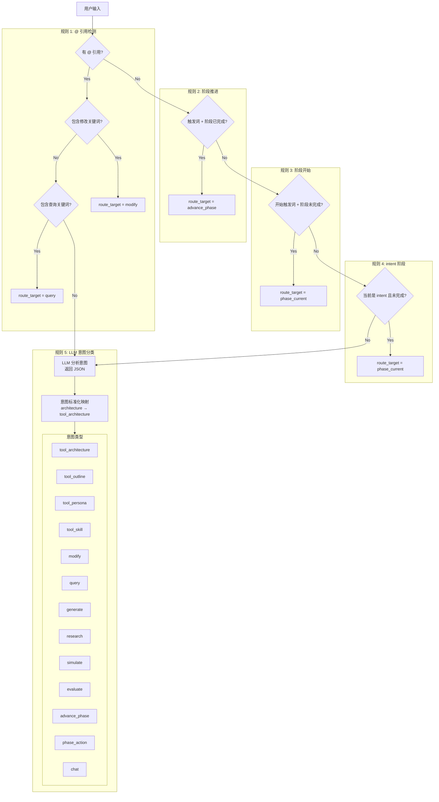
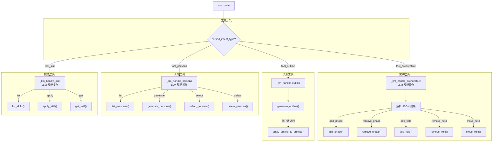
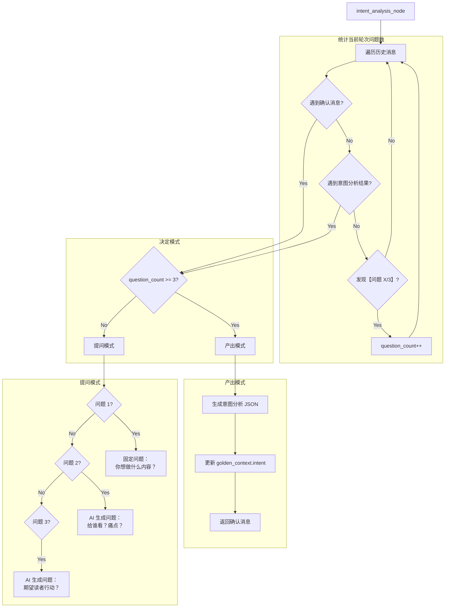
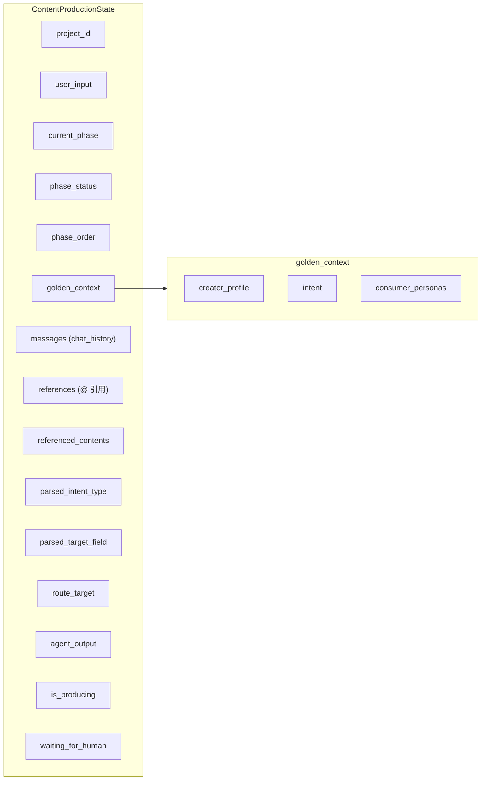

# Agent 架构图

> 更新时间: 2026-02-04
> 基于 LangGraph 实现的内容生产 Agent

## 1. 整体架构流程图

```mermaid
flowchart TB
    subgraph Entry["入口"]
        START([用户输入])
    end

    subgraph Router["路由层"]
        ROUTER[["route_intent<br/>LLM 意图识别"]]
    end

    subgraph Tools["工具层"]
        TOOL_ARCH["tool_node<br/>架构操作"]
        TOOL_OUTLINE["tool_node<br/>大纲生成"]
        TOOL_PERSONA["tool_node<br/>人物管理"]
        TOOL_SKILL["tool_node<br/>技能管理"]
    end

    subgraph Phases["阶段节点层"]
        INTENT["intent_analysis_node<br/>意图分析（3轮问答）"]
        RESEARCH["research_node<br/>消费者调研"]
        DESIGN_I["design_inner_node<br/>内涵设计"]
        PRODUCE_I["produce_inner_node<br/>内涵生产"]
        DESIGN_O["design_outer_node<br/>外延设计"]
        PRODUCE_O["produce_outer_node<br/>外延生产"]
        SIMULATE["simulate_node<br/>消费者模拟"]
        EVALUATE["evaluate_node<br/>项目评估"]
    end

    subgraph Reference["引用处理层"]
        MODIFY["modify_node<br/>修改字段内容"]
        QUERY["query_node<br/>查询字段信息"]
    end

    subgraph Dialogue["对话层"]
        CHAT["chat_node<br/>自由对话"]
    end

    subgraph Output["输出"]
        END_NODE([返回结果])
    end

    START --> ROUTER

    ROUTER -->|"tool_architecture"| TOOL_ARCH
    ROUTER -->|"tool_outline"| TOOL_OUTLINE
    ROUTER -->|"tool_persona"| TOOL_PERSONA
    ROUTER -->|"tool_skill"| TOOL_SKILL

    ROUTER -->|"phase_intent"| INTENT
    ROUTER -->|"phase_research"| RESEARCH
    ROUTER -->|"phase_design_inner"| DESIGN_I
    ROUTER -->|"phase_produce_inner"| PRODUCE_I
    ROUTER -->|"phase_design_outer"| DESIGN_O
    ROUTER -->|"phase_produce_outer"| PRODUCE_O
    ROUTER -->|"phase_simulate"| SIMULATE
    ROUTER -->|"phase_evaluate"| EVALUATE

    ROUTER -->|"modify + @引用"| MODIFY
    ROUTER -->|"query + @引用"| QUERY

    ROUTER -->|"chat"| CHAT

    TOOL_ARCH --> END_NODE
    TOOL_OUTLINE --> END_NODE
    TOOL_PERSONA --> END_NODE
    TOOL_SKILL --> END_NODE

    INTENT -->|"is_producing=false"| END_NODE
    INTENT -->|"is_producing=true"| END_NODE
    
    RESEARCH --> END_NODE
    DESIGN_I --> END_NODE
    PRODUCE_I --> END_NODE
    DESIGN_O --> END_NODE
    PRODUCE_O --> END_NODE
    SIMULATE --> END_NODE
    EVALUATE --> END_NODE

    MODIFY --> END_NODE
    QUERY --> END_NODE
    CHAT --> END_NODE

    style ROUTER fill:#f9f,stroke:#333,stroke-width:2px
    style TOOL_ARCH fill:#bbf,stroke:#333
    style TOOL_OUTLINE fill:#bbf,stroke:#333
    style TOOL_PERSONA fill:#bbf,stroke:#333
    style TOOL_SKILL fill:#bbf,stroke:#333
    style INTENT fill:#bfb,stroke:#333
    style RESEARCH fill:#bfb,stroke:#333
```



## 2. 意图路由详细流程



## 3. 工具节点详细流程



## 4. 意图分析节点详细流程



## 5. 状态数据流



## 6. 关键路由逻辑说明

### 6.1 route_intent（意图路由器）

```python
async def route_intent(state) -> state:
    """
    5 层规则，按优先级执行：
    
    1. @ 引用检测
       - 有引用 + 修改词 → modify
       - 有引用 + 查询词 → query
    
    2. 阶段推进
       - 触发词 + 当前阶段已完成 → advance_phase
    
    3. 阶段开始
       - 开始词 + 当前阶段未完成 → phase_current
    
    4. intent 阶段特殊处理
       - 当前是 intent 且未完成 → phase_current
    
    5. LLM 意图分类
       - 调用 LLM 返回 JSON
       - 标准化映射（architecture → tool_architecture）
       - 返回最终 route_target
    """
```

### 6.2 route_by_intent（节点路由器）

```python
def route_by_intent(state) -> str:
    """
    根据 route_target 返回下一个节点名：
    
    - phase_current → phase_{current_phase}
    - advance_phase → phase_{next_phase}
    - tool_* → tool
    - modify/query → modify/query
    - chat → chat
    """
```

### 6.3 tool_node（工具执行器）

```python
async def tool_node(state) -> state:
    """
    根据 parsed_intent_type 分发到具体工具处理器：
    
    - tool_architecture → _llm_handle_architecture()
    - tool_outline → _llm_handle_outline()
    - tool_persona → _llm_handle_persona()
    - tool_skill → _llm_handle_skill()
    
    每个处理器内部再用 LLM 解析具体操作参数
    """
```

## 7. 可用工具清单

| 工具 | 函数 | 功能 |
|------|------|------|
| **架构读取** | `get_project_architecture()` | 读取项目结构 |
| **架构修改** | `add_phase()`, `remove_phase()`, `add_field()`, `remove_field()`, `move_field()` | 修改项目结构 |
| **大纲生成** | `generate_outline()`, `apply_outline_to_project()` | 生成内容大纲 |
| **人物管理** | `list_personas()`, `generate_persona()`, `select_persona()`, `delete_persona()` | 管理用户画像 |
| **技能管理** | `list_skills()`, `apply_skill()`, `get_skill()`, `create_skill()` | 管理提示词技能 |
| **深度调研** | `deep_research()` | DuckDuckGo + Jina 调研 |
| **消费者模拟** | `simulate()` | 5 种模拟类型 |
| **评估** | `evaluate()` | 多维度评估 |

## 8. LangGraph 节点注册

```python
# 节点注册
graph.add_node("router", route_intent)
graph.add_node("chat", chat_node)
graph.add_node("research", research_node)
graph.add_node("modify", modify_node)
graph.add_node("query", query_node)
graph.add_node("tool", tool_node)

# 阶段节点
for phase in ["intent", "research", "design_inner", "produce_inner", 
              "design_outer", "produce_outer", "simulate", "evaluate"]:
    graph.add_node(f"phase_{phase}", phase_node)

# 条件边：从 router 分发
graph.add_conditional_edges("router", route_by_intent, {
    "phase_intent": "phase_intent",
    "phase_research": "phase_research",
    # ... 其他阶段
    "modify": "modify",
    "query": "query",
    "tool": "tool",
    "chat": "chat",
})

# 所有节点 → END
graph.add_edge("tool", END)
graph.add_edge("chat", END)
graph.add_edge("modify", END)
graph.add_edge("query", END)
```
