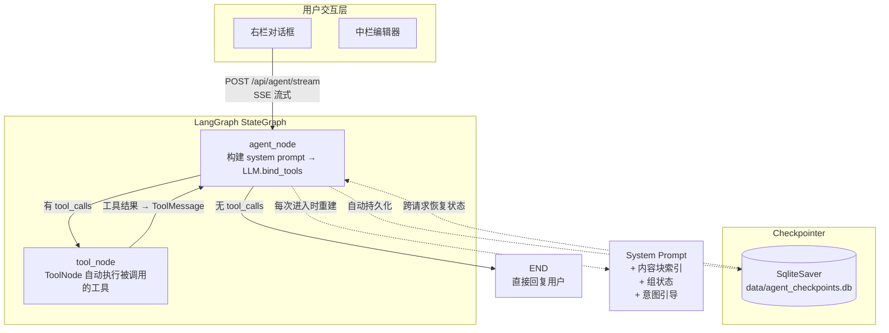

# Agent 架构设计
# 创建时间: 20260202
# 更新时间: 20260214
# 功能: 定义LangGraph Agent的状态图、节点、边、工具
# 架构: LLM Tool Calling + StateGraph + SqliteSaver

## Agent 核心架构

使用 LangGraph 构建最小状态图，LLM 通过 `bind_tools` 自主选择工具（无手动路由）。

### 设计原则

1. **一个 system prompt 定义 Agent 全部行为规则**
2. **@tool docstrings 告诉 LLM 每个工具何时使用**
3. **LLM 自主决定：直接回复 or 调用工具**（不再需要手动意图分类 + if/elif 路由）
4. **所有 DB 操作在 @tool 函数内完成**，不通过 State 传递
5. **SqliteSaver 跨请求/跨重启保持对话状态**（含 ToolMessage）
6. **trim_messages 管理 context window**，防止超限

### 实现状态 ✅

- [x] LLM Tool Calling 自主决策
- [x] 12 个 Agent 工具
- [x] SqliteSaver 持久化 Checkpointer
- [x] 动态 System Prompt（含内容块索引、组状态、意图引导）
- [x] Context Window 裁剪（trim_messages）
- [x] 工具执行后缓存自动失效

## 状态定义

```python
class AgentState(TypedDict):
    """Agent 状态（精简版，仅 4 个字段）"""
    messages: Annotated[list[BaseMessage], operator.add]  # 对话历史（LangGraph 核心）
    project_id: str                                        # 项目 ID（传递给工具）
    current_phase: str                                     # 当前组（注入到 system prompt）
    creator_profile: str                                   # 创作者画像（注入到 system prompt）
```

**设计决策**：
- `messages` 通过 `operator.add` 自动累积，由 Checkpointer 持久化
- `project_id` 通过 `config["configurable"]["project_id"]` 透传给 @tool
- DB 状态（phase_status、field 内容等）在 @tool 内部查询，不存入 State
- 旧版 `golden_context`、`fields`、`autonomy_settings`、`waiting_for_human` 均已移除

## 流程图 (Mermaid)



### 核心循环

```
agent_node ──(有 tool_calls)──→ tool_node ──→ agent_node（循环）
    │
    └──(无 tool_calls)──→ END
```

一次对话中，如果 LLM 连续调用 3 个工具，`agent_node` 会执行 4 次（初始 + 每次工具返回后重入）。

## System Prompt 动态构建

`build_system_prompt(state)` 在每次 `agent_node` 进入时重新生成，包含：

| 段落 | 内容 | 数据来源 |
|------|------|---------|
| 能力声明 | 8 大能力描述 | 硬编码 |
| 创作者信息 | creator_profile | `state["creator_profile"]` |
| 当前组上下文 | phase + phase_status | DB 查询 `Project` |
| 内容块索引 | 所有块名称+摘要，按组归类 | `digest_service.build_field_index()` (30s TTL 缓存) |
| 意图引导 | 3 问流程、保存规则 | 仅 `current_phase == "intent"` 时注入 |
| @ 引用约定 | `@内容块名` 的消歧规则 | 硬编码 |
| 消歧规则 | 添加 vs 修改、进入 vs 操作、调研类型、生成 vs 修改 | 硬编码 |
| 输出格式 | 完整句子、Markdown、中文 | 硬编码 |

### 缓存策略

- `build_field_index()` 结果有 30 秒 TTL 缓存（`digest_service._field_index_cache`）
- 工具执行后（检测到 `ToolMessage`），自动调用 `invalidate_field_index_cache()` 使缓存失效
- 同一对话轮次多次 agent_node 执行不会重复查 DB

## 工具列表 (AGENT_TOOLS)

| # | 工具名 | 功能 | 关键参数 |
|---|--------|------|---------|
| 1 | `modify_field` | 修改已有内容块 | field_name, modification_instruction, reference_fields |
| 2 | `generate_field_content` | 生成内容块内容 | field_name, style_hint |
| 3 | `query_field` | 查询内容块（简要） | field_name |
| 4 | `read_field` | 读取内容块完整内容 | field_name |
| 5 | `update_field` | 直接更新内容块 | field_name, content |
| 6 | `manage_architecture` | 管理项目架构（增删移动块/组） | action, block_name, parent_name, ... |
| 7 | `advance_to_phase` | 推进到下一组 | target_phase(可选) |
| 8 | `run_research` | 消费者调研 / 通用调研 | query, research_type |
| 9 | `manage_persona` | 管理消费者画像 | action, persona_data |
| 10 | `run_evaluation` | 多维度评估内容质量 | target_fields, eval_dimensions |
| 11 | `generate_outline` | 生成项目大纲 | style, additional_instructions |
| 12 | `manage_skill` | 管理 Agent Skill | action, skill_data |

### 产出工具（触发前端刷新）

```python
PRODUCE_TOOLS = {"modify_field", "generate_field_content", "update_field"}
```

工具执行结果通过 `astream_events` 中的 `on_tool_end` 事件推送给前端，前端检测到 PRODUCE_TOOLS 中的工具完成后自动刷新内容区域。

## 意图分析阶段（特殊处理）

意图分析阶段有两种交互模式，由 system prompt 中的意图引导段控制：

### 1. 引导提问模式
- **触发条件**: `current_phase == "intent"` 且对话未收集完 3 个问题
- **AI 行为**: 依次问 3 个问题（做什么、给谁看、期望行动）
- **输出位置**: 只在右侧对话区显示
- **是否保存**: 不保存

### 2. 产出保存模式
- **触发条件**: 3 个问题回答完毕
- **AI 行为**: 生成结构化意图分析摘要，调用 `update_field(field_name="意图分析", content=摘要)` 保存
- **输出位置**: 保存为 ContentBlock，显示在中间内容栏

**其他阶段**: LLM 根据 system prompt 和 @tool docstrings 自主决定工具调用，直接保存为 ContentBlock。

## Checkpointer 持久化

```python
# SqliteSaver — 对话状态（含 Human/AI/ToolMessage 全部类型）跨请求持久化
from langgraph.checkpoint.sqlite import SqliteSaver

db_path = "data/agent_checkpoints.db"
conn = sqlite3.connect(db_path, check_same_thread=False)
checkpointer = SqliteSaver(conn)
checkpointer.setup()

graph.compile(checkpointer=checkpointer)
```

**关键改进**（P0-2, 2026-02-13）：
- 旧方案：`MemorySaver`（内存） + `ChatMessage` 表 Bootstrap → 重启后 ToolMessage 丢失
- 新方案：`SqliteSaver` 直接持久化全部消息类型，无需 Bootstrap

## API 端点

| 端点 | 方法 | 用途 | 状态 |
|------|------|------|------|
| `/api/agent/stream` | POST | SSE 流式对话（主入口） | ✅ 活跃 |
| `/api/agent/retry` | POST | 重试最后一条消息 | ✅ 活跃 |
| `/api/agent/advance` | POST | 前端按钮推进阶段 | ✅ 活跃 |
| `/api/agent/chat` | POST | 非流式对话 | ⚠️ Deprecated |

## 阶段配置 (SSOT)

所有阶段定义集中在 `backend/core/phase_config.py`：

```python
PHASE_DEFINITIONS = [
    {"code": "intent",        "display_name": "意图分析"},
    {"code": "research",      "display_name": "消费者调研"},
    {"code": "design_inner",  "display_name": "内涵设计"},
    {"code": "produce_inner", "display_name": "内涵生产"},
    {"code": "design_outer",  "display_name": "外延设计"},
    {"code": "produce_outer", "display_name": "外延生产"},
    {"code": "evaluate",      "display_name": "评估"},
]
# 自动派生: PHASE_ORDER, PHASE_DISPLAY_NAMES, PHASE_ALIAS, ...
```

## 数据模型

系统统一使用 `ContentBlock` 作为唯一的内容数据模型（P0-1, 2026-02-14 完成统一）。

- `ProjectField` 已废弃，`api/fields.py` 路由保留但标记 deprecated
- 所有 Agent 工具、digest 服务、架构读写器均只查 `ContentBlock`
- 前端统一使用 `blockAPI`，`fieldAPI` 已标记 deprecated
- `Project.golden_context` JSON 字段已废弃（P3-2），创作者特质通过 `creator_profile` 关系获取，意图/调研结果通过 ContentBlock 依赖链传递

## 已移除的旧设计

以下概念在早期版本中存在，已在架构优化中移除：

| 旧概念 | 移除原因 | 替代方案 |
|--------|---------|---------|
| `ContentProductionState`（7 字段） | 过重的 State，含 golden_context/fields/autonomy | `AgentState`（4 字段），DB 操作在 @tool 内完成 |
| `ContentProductionAgent` 兼容类 | P3-1 清理 | 直接使用 `agent_graph.ainvoke()` |
| 意图路由器 (`route_intent`) | LLM Tool Calling 自动路由 | system prompt + bind_tools |
| 自主权检查点 (`autonomy_settings`) | 未实际使用 | — |
| `golden_context` State 字段 | 信息已通过 system prompt 注入 | `build_system_prompt()` 动态构建 |
| `_load_seed_history()` Bootstrap | SqliteSaver 持久化全部消息 | Checkpointer 自动恢复 |
| `normalize_intent()` / `normalize_consumer_personas()` | 无调用方 | — |
